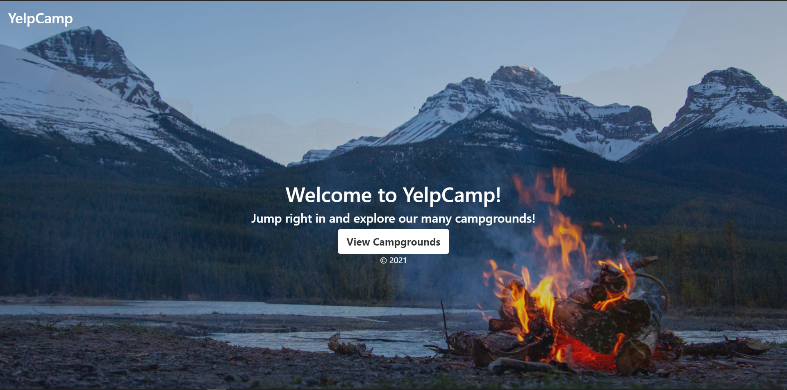
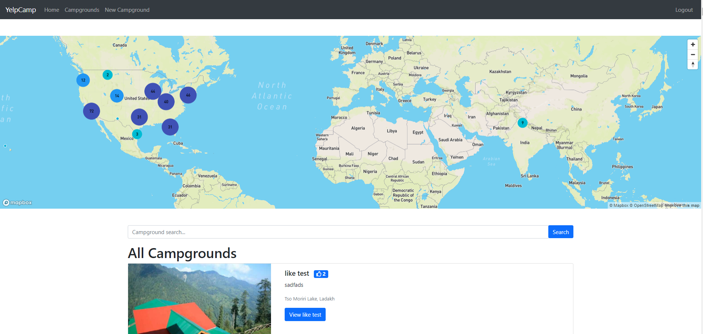
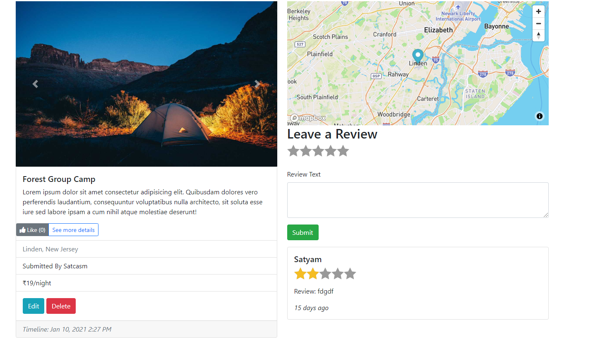

# YelpCamp

YelpCamp is a website where users can create and review campgrounds. In order to review or create a campground, you must have an account.
This project was created using Node.js, Express, MongoDB, and Bootstrap. Passport.js was used to handle authentication.

## Screenshots

## Features

* Authentication:
  * User login with username and password
  
* Authorization:
  * One cannot manage posts without being authenticated
  * One cannot edit or delete posts and reviews created by other users
  
* Manage campground posts with basic functionalities:
  * Create, edit and delete posts and reviews
  * Like feature
  * Upload campground photos(multiple photos are allowed)
  * Display campground location on Maps
  * Search existing campgrounds
  
* Manage user account with basic functionalities:
  * Password reset via email confirmation
  
* Flash messages responding to users' interaction with the app

## Custom Enhancements

* Update campground photos and location when editing campgrounds
* Checking the size of the images while uploading via multer
* Use Helmet to strengthen security

